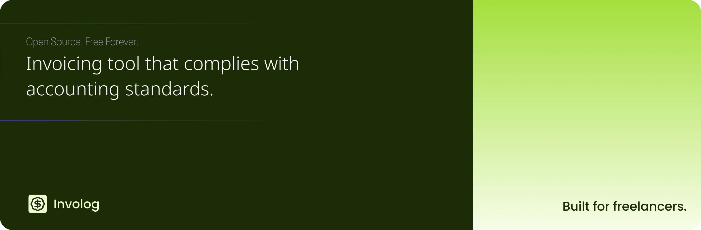

> [!IMPORTANT]
> Involog is under active development. Track progress via [GitHub issues](https://github.com/unproducts/involog/issues).

<h1 align="center">
  Involog
</h1>

    Invoicing solution built for freelancers and small-to-medium agencies that combines accounting compliance with simplicity.

 
Unlike existing tools that are either overly complex or lack proper ledger maintenance, Involog automatically generates double-entry ledgers, trial balances, and other accounting essentials—without requiring users to understand accounting principles. The backend enforces proper bookkeeping, while the frontend remains intuitive and clutter-free.
